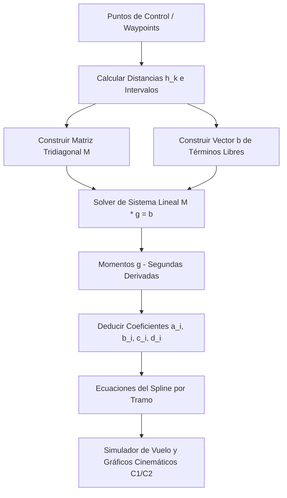

# SplineFly - Calculadora de Splines Cúbicos & Simulador de Drones
**Fecha:** 3 de Junio de 2026 | **Ciclo:** 2026-1

## 📌 1. Arquitectura y Lógica Implementada

### Descripción
El proyecto **SplineFly** es una suite interactiva dual (Desktop Python Tkinter y Web HTML5/Canvas/JS) diseñada para resolver el problema clásico de la planificación de trayectorias suaves en robótica (específicamente, navegación de drones). 

En el ámbito físico, unir puntos de control (waypoints) utilizando interpolación lineal simple genera cambios bruscos en la velocidad en cada nodo (discontinuidad de la primera derivada), lo cual requeriría fuerza infinita instantánea de los motores ($F = m \cdot a$) y causaría vibraciones mecánicas dañinas. Las splines cuadráticas corrigen esto logrando continuidad en la velocidad ($C^1$), pero la aceleración (segunda derivada) mantiene saltos discretos (sacudidas instantáneas). 

**SplineFly** implementa **Splines Cúbicos Naturales**, garantizando continuidad de clase $C^2$ (posición, velocidad $y'(x)$ y aceleración $y''(x)$ continuas en todo el dominio). Esto permite que el dron navegue de forma físicamente fluida, amortiguando esfuerzos mecánicos y asegurando un despegue y aterrizaje suaves mediante las condiciones de frontera naturales ($S''(x_0) = S''(x_n) = 0$).



---

### Componentes Clave
1. **Motor de Splines Cúbicos Naturales (Math Engine):**
   - **En Python ([TB1_Final.py](file:///c:/Users/franc/OneDrive/Escritorio/Upc/2026-1/AlgebraLineal/TB1_Final.py#L47-L95)):** Utiliza `numpy` para resolver el sistema matricial tridiagonal mediante `np.linalg.solve`.
   - **En JavaScript ([script.js](file:///c:/Users/franc/OneDrive/Escritorio/Upc/2026-1/AlgebraLineal/script.js#L160-L215)):** Implementa la deducción matemática completa desde cero, construyendo la matriz tridiagonal $M$ y el vector $b$.
2. **Solver Lineal Custom (`solveLinearSystem` en [script.js](file:///c:/Users/franc/OneDrive/Escritorio/Upc/2026-1/AlgebraLineal/script.js#L100-L154)):**
   - Implementación de **Eliminación Gaussiana con Pivoteo Parcial** para resolver el sistema $M \cdot g = b$ de manera robusta en el navegador, evitando divisiones por cero o imprecisiones por mal condicionamiento numérico.
3. **Módulo de Evaluación Dinámica (`evaluateSplinesAt`):**
   - Evalúa en tiempo real la altura ($y$), la velocidad vertical ($y'$) y la aceleración vertical ($y''$) para cualquier coordenada $x$, localizando el intervalo correspondiente $[x_i, x_{i+1}]$ mediante algoritmos de búsqueda por tramos.
4. **Simulador de Vuelo y Render de Cinemática:**
   - **Visualización 2D del Mapa:** Renderiza al dron esquivando obstáculos circulares estáticos siguiendo la trayectoria del spline.
   - **Gráficos Cinemáticos de Tiempo Real:** Grafica de forma paralela la curva de velocidad $y'(x)$ (curva suave continua) y aceleración $y''(x)$ (poligonal continua) marcando la posición actual del dron para evidenciar empíricamente la continuidad $C^2$.
5. **Comparador de Lagrange (`evaluateLagrangeAt`):**
   - Muestra el polinomio interpolador global de Lagrange para contrastar el comportamiento suave y local de los splines frente a las severas oscilaciones del fenómeno de Runge en polinomios de alto grado.

---

## 🗄️ 2. Estructura de Datos / Modelo de Datos

Al tratarse de una aplicación matemática interactiva enfocada en la simulación cliente-servidor y frontend de escritorio, los datos se manejan en memoria con estructuras JSON estrictas. El esquema del flujo de datos se modela a continuación:

```json
{
  "$schema": "http://json-schema.org/draft-07/schema#",
  "title": "SplineFlyMissionData",
  "type": "object",
  "properties": {
    "waypoints": {
      "type": "array",
      "description": "Lista de puntos de control obligatorios ordenados ascendentemente en X.",
      "minItems": 3,
      "items": {
        "type": "object",
        "required": ["x", "y"],
        "properties": {
          "x": { "type": "number", "description": "Coordenada horizontal (tiempo/desplazamiento)" },
          "y": { "type": "number", "description": "Coordenada vertical (altitud del dron)" }
        }
      }
    },
    "obstacles": {
      "type": "array",
      "description": "Lista de zonas de peligro circulares en el mapa de vuelo.",
      "items": {
        "type": "object",
        "required": ["x", "y", "r"],
        "properties": {
          "x": { "type": "number", "description": "Centro horizontal del obstáculo" },
          "y": { "type": "number", "description": "Centro vertical del obstáculo" },
          "r": { "type": "number", "minimum": 0.1, "description": "Radio de colisión" }
        }
      }
    },
    "calculatedSplines": {
      "type": "array",
      "description": "Coeficientes polinomiales calculados para cada tramo i.",
      "items": {
        "type": "object",
        "required": ["a", "b", "c", "d", "x0", "x1"],
        "properties": {
          "a": { "type": "number", "description": "Coeficiente constante (posición inicial del tramo)" },
          "b": { "type": "number", "description": "Coeficiente lineal (velocidad inicial del tramo)" },
          "c": { "type": "number", "description": "Coeficiente cuadrático (aceleración/2 inicial del tramo)" },
          "d": { "type": "number", "description": "Coeficiente cúbico (razón de cambio de aceleración)" },
          "x0": { "type": "number", "description": "Límite izquierdo del intervalo" },
          "x1": { "type": "number", "description": "Límite derecho del intervalo" }
        }
      }
    }
  }
}
```

---

## 🛠️ 3. Pasos para Despliegue / Pruebas Locales

El proyecto cuenta con dos implementaciones independientes para pruebas.

### Opción A: Aplicación de Escritorio en Python (Tkinter + Matplotlib)
1. Asegúrate de tener Python 3.8+ instalado.
2. Instala las librerías científicas requeridas:
   ```bash
   pip install numpy matplotlib
   ```
3. Ejecuta la aplicación GUI:
   ```bash
   python TB1_Final.py
   ```
4. *(Opcional)* Para verificar la lógica del prototipo de consola inicial:
   ```bash
   python TB1.py
   ```

### Opción B: Aplicación Web Interactiva (HTML5 / Vanilla CSS / JS)
1. Dado que no cuenta con dependencias de servidor ni módulos externos, puedes abrir el archivo directamente en cualquier navegador moderno:
   ```bash
   # En Windows (PowerShell)
   Start-Process chrome .\index.html
   ```
2. O puedes levantar un servidor web local super liviano para desarrollo:
   ```bash
   # Usando Node.js
   npx serve .
   
   # O usando Python
   python -m http.server 8000
   ```
3. Accede desde tu navegador en `http://localhost:5000` o `http://localhost:8000`.

---

## 🐛 4. Bitácora de Errores y Soluciones (Troubleshooting)

### Problema 1: Inestabilidad numérica y división por cero en el Solver Lineal de JavaScript
* **Detalle del bug:** El solver lineal original no contemplaba pivoteo. Al ingresar ciertos puntos donde la diagonal principal de la matriz $M$ reducida contenía un cero o un número extremadamente cercano a él, la eliminación Gaussiana fallaba catastróficamente con resultados `NaN` o `Infinity`, colgando el renderizado de la trayectoria del dron.
* **Solución:** Se implementó una rutina de **Pivoteo Parcial** que busca la fila con el mayor valor absoluto en la columna actual y la intercambia con la fila pivote antes de anular los elementos inferiores, eliminando cualquier división por cero y garantizando la robustez numérica.
* **Código corregido:**
  ```javascript
  // Fragmento de script.js - solveLinearSystem con pivoteo parcial
  for (let i = 0; i < n; i++) {
      // 1. Encontrar fila pivote (el elemento máximo en la columna i)
      let maxEl = Math.abs(A[i][i]);
      let maxRow = i;
      for (let k = i + 1; k < n; k++) {
          if (Math.abs(A[k][i]) > maxEl) {
              maxEl = Math.abs(A[k][i]);
              maxRow = k;
          }
      }
      
      // 2. Intercambiar filas para estabilidad numérica
      const tempRow = A[maxRow];
      A[maxRow] = A[i];
      A[i] = tempRow;
  
      const tempVal = y[maxRow];
      y[maxRow] = y[i];
      y[i] = tempVal;
  
      // 3. Eliminación hacia adelante
      for (let k = i + 1; k < n; k++) {
          if (A[i][i] === 0) continue;
          const factor = -A[k][i] / A[i][i];
          for (let j = i; j < n; j++) {
              if (i === j) {
                  A[k][j] = 0;
              } else {
                  A[k][j] += factor * A[i][j];
              }
          }
          y[k] += factor * y[i];
      }
  }
  ```

### Problema 2: Distorsión y violación del dominio matemático al arrastrar puntos fuera de orden
* **Detalle del bug:** Si un usuario arrastraba un punto en el canvas de modo que su coordenada $x$ cruzara horizontalmente a otro punto vecino ($x_{i+1} \leq x_i$), la distancia $h_i$ se volvía negativa o cero. Esto provocaba que el sistema matricial tridiagonal perdiera su propiedad de diagonal dominante y colapsara el cálculo de splines.
* **Solución:** Se implementaron dos salvaguardas:
  1. El arrastre interactivo en el canvas se restringió de forma estricta para que el usuario **solo altere la altura (Y)** del punto seleccionado.
  2. Para las inserciones manuales y adición mediante doble clic, se ordena el arreglo de puntos mediante una función de comparación ascendente en X y se bloquea la adición si la distancia horizontal con otro nodo es inferior a un umbral límite de $0.25$ unidades.
* **Código corregido:**
  ```javascript
  // Restringir arrastre en script.js a la componente Y para salvaguardar el orden en X
  if (dragPointIndex !== -1) {
      const mPos = canvasToMath(cx, cy, w, h);
      calcPoints[dragPointIndex].y = mPos.y; // Únicamente modifica Y
      recomputeAllCalculator();
  }
  
  // Validación de cercanía horizontal en doble clic
  const umbral = 0.25;
  const isClose = calcPoints.some(p => Math.abs(p.x - mPos.x) < umbral);
  if (!isClose) {
      calcPoints.push({ x: mPos.x, y: mPos.y });
      calcPoints.sort((a, b) => a.x - b.x); // Ordenamiento explícito
      recomputeAllCalculator();
  }
  ```

---

## 🎯 5. Siguientes Pasos (Pendientes)
- [ ] **Algoritmo de Evasión Dinámica de Obstáculos (Planificación de Ruta Activa):** Implementar un resolvedor que verifique si la trayectoria del spline intersecta los límites circulares de un obstáculo. Si ocurre colisión, el sistema debe re-calcular automáticamente waypoints de desvío (nodos virtuales) para deformar suavemente el spline y esquivar el peligro sin perder la continuidad $C^2$.
- [ ] **Persistencia Local de Rutas Customizadas:** Añadir soporte para guardar y cargar misiones personalizadas usando `localStorage` en la versión web y serialización JSON a archivos de disco (`.json`) en la versión Python Tkinter.
- [ ] **Planificación de Trayectoria en 3D:** Expandir la formulación matemática a tres dimensiones ($x(t), y(t), z(t)$) parametrizadas por el tiempo $t$, y migrar la animación de vuelo a un motor 3D interactivo utilizando WebGL (Three.js) o Vpython.
