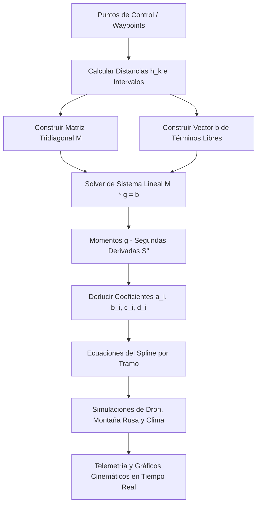

# SplineSim - Calculadora de Splines Cúbicos & Simulador Multi-Aplicación
**Fecha:** 5 de Junio de 2026 | **Ciclo:** 2026-1

## 📌 1. Arquitectura y Lógica Implementada

### Descripción
El proyecto **SplineSim** es una suite interactiva e interdisciplinar diseñada para demostrar la aplicación práctica de los **Splines Cúbicos Naturales** en la resolución de problemas reales de física, robótica e ingeniería. La aplicación cuenta con una calculadora teórica y un banco de pruebas de simulación que abarca tres grandes áreas:

1. **Navegación Suave de Drones (Robótica):** Planificación de trayectorias seguras con velocidad y aceleración continuas en tres misiones predefinidas (evasión de obstáculos, inspección agrícola con plantas `🌱` y entrega de paquetes `📦`).
2. **Física del Confort en Montañas Rusas (Ingeniería Mecánica):** Análisis de confort mediante el cálculo dinámico de la velocidad por conservación de la energía, Fuerza G y la sacudida vertical (*Jerk*).
3. **Modelado Climatológico (Ciencia de Datos):** Comparación empírica entre interpolación lineal ($C^0$), interpolación global de Lagrange (exhibiendo el *Fenómeno de Runge*) y splines cúbicos ($C^2$).



---

### Fundamentos Matemáticos y Físicos de las Aplicaciones

#### A. Continuidad $C^2$ vs $C^1$ y $C^0$
- **Interpolación Lineal ($C^0$):** Solo garantiza continuidad en la posición. Presenta "picos" o esquinas duras en los nodos. La primera derivada ($y'$) es discontinua, lo que en física implica cambios instantáneos de velocidad (aceleraciones infinitas) imposibles de realizar por un sistema físico real.
- **Splines Cuadráticos ($C^1$):** Logran continuidad en la velocidad ($y'$), pero la aceleración ($y''$) es discontinua (escalones discretos). Esto genera picos infinitos en la tasa de cambio de la aceleración (*Jerk* infinito).
- **Splines Cúbicos Naturales ($C^2$):** Garantizan continuidad en la posición, la velocidad ($y'$) y la aceleración ($y''$). Las condiciones de frontera natural imponen que la curvatura en los extremos es cero:
  $$S''(x_0) = S''(x_n) = 0$$

#### B. Física del Recorrido de Montaña Rusa
El carrito de la montaña rusa se modela como una partícula que se desliza sin fricción bajo la influencia de la gravedad.
- **Velocidad ($v$):** Derivada de la ley de conservación de la energía mecánica:
  $$E_{mec} = \frac{1}{2} m v^2 + m g y = \text{Constante}$$
  $$v(y) = \sqrt{v_{\text{inicio}}^2 + 2 g (y_{\text{inicio}} - y)}$$
  Donde $v_{\text{inicio}} = 3.0\text{ m/s}$ representa el impulso inicial en la cima de la colina.
- **Diferencial de arco ($ds$) e Integración de Posición:**
  Para mover el carro a lo largo del spline tramo por tramo con velocidad variable física, avanzamos un paso temporal $dt$:
  $$ds = v \cdot dt$$
  $$dx = \frac{ds}{\sqrt{1 + (y'(x))^2}}$$
  Esta ecuación se integra numéricamente paso a paso para actualizar la posición horizontal $x$ en cada fotograma de animación.
- **Fuerza G Sentida por el Pasajero ($G_y$):**
  La Fuerza G que experimenta un pasajero en el eje vertical es la suma de la componente de gravedad normal a la pista y la aceleración centrípeta dividida por $g$:
  $$G_y = \cos\theta + \frac{a_c}{g} = \frac{1}{\sqrt{1 + (y')^2}} + \frac{v^2 \cdot \kappa}{g}$$
  Donde la **curvatura local ($\kappa$)** del spline cúbico viene dada por:
  $$\kappa = \frac{y''}{(1 + (y')^2)^{1.5}}$$
- **Sacudida / Jerk ($J$):**
  Es la derivada temporal de la aceleración. En física médica, un Jerk elevado provoca latigazo cervical.
  $$J = \frac{da}{dt}$$
  Dado que las splines cúbicas garantizan continuidad de clase $C^2$, la aceleración ($y''$) es continua. Esto asegura que la tasa de cambio de la aceleración centrípeta sea **finita** y controlada, previniendo choques cinemáticos bruscos.

#### C. Modelado de Clima y el Fenómeno de Runge
- **Fenómeno de Runge:** Ocurre al interpolar un conjunto de puntos equiespaciados utilizando un único polinomio global de Lagrange de alto grado. El polinomio tiende a oscilar de forma violenta y divergente cerca de los extremos del intervalo.
- **Solución con Splines Cúbicos:** Al segmentar el dominio en sub-intervalos locales unidos con polinomios cúbicos de grado bajo (3), se elimina la inestabilidad de Runge y se mantiene una representación térmica realista durante las 24 horas del día.

---

### Componentes Clave del Software
1. **Motor de Splines Cúbicos Naturales (Math Engine):**
   - **En JavaScript ([script.js](./js/script.js#L100-L215)):** Implementa la deducción matemática completa desde cero, construyendo la matriz tridiagonal $M$, el vector $b$, y resolviéndolo mediante eliminación Gaussiana con pivoteo parcial.
2. **Solver Lineal Custom (`solveLinearSystem` en [script.js](./js/script.js#L100-L154)):**
   - Implementa la eliminación Gaussiana con pivoteo parcial de manera robusta directamente en JavaScript para evitar indeterminaciones.
3. **Telemetría y Gráficos Dinámicos (Canvas 2D):**
   - **Mapa de Simulación:** Representación animada del dron y del carro de montaña rusa recorriendo el spline en tiempo real.
   - **Monitoreo Cinemático:** Gráficas sincronizadas de velocidad, aceleración, fuerzas G y Jerk que se actualizan de forma continua para verificar empíricamente la suavidad física del spline cúbico natural.

---

## 🗄️ 2. Estructura de Datos / Modelo de Datos

Los datos de control y configuración de las simulaciones están centralizados en bases de datos en memoria en [script.js](./js/script.js).

### Esquema de Misiones de Drones (`MISIONES_DB`)
```javascript
const MISIONES_DB = {
    "1": {
        waypoints: [{x: 0, y: 2.0}, {x: 2.0, y: 5.5}, {x: 5.0, y: 1.5}, {x: 7.5, y: 6.0}, {x: 10.0, y: 3.0}],
        obstacles: [
            {x: 1.0, y: 1.2, r: 0.5}, // Obstáculo terrestre
            {x: 3.5, y: 5.8, r: 0.5}, // Obstáculo aéreo
            {x: 6.2, y: 1.2, r: 0.5},
            {x: 8.8, y: 6.8, r: 0.5}  // Ajustado a y=6.8 para evitar colisión con el spline
        ]
    },
    ...
};
```

### Esquema de Pistas de Montaña Rusa (`TRACKS_DB`)
```javascript
const TRACKS_DB = {
    "1": { // Camelback (Gran Caída y Colina)
        waypoints: [{x: 0, y: 6.5}, {x: 2.2, y: 1.0}, {x: 5.0, y: 4.8}, {x: 7.8, y: 1.2}, {x: 10.0, y: 3.5}]
    },
    ...
};
```

### Esquema de Datos de Clima (`WEATHER_DB`)
```javascript
const WEATHER_DB = {
    "1": { // Ciclo térmico diario típico
        points: [
            {x: 0, y: 12.0, note: "Medianoche"},
            {x: 4, y: 8.0, note: "Mínima diaria"},
            {x: 8, y: 15.0, note: "Calentamiento"},
            ...
        ]
    }
};
```

---

## 🛠️ 3. Pasos para Despliegue / Pruebas Locales

La aplicación es un sitio web estático. Para probarla localmente:

1. Levanta un servidor web en el directorio raíz del proyecto:
   ```bash
   # Con Python (servidor HTTP estático)
   python -m http.server 5500
   
   # O con Node.js
   npx serve .
   ```
2. Abre tu navegador web e ingresa a `http://localhost:5500` (o el puerto indicado por el servidor).

---

## 🐛 4. Bitácora de Errores y Soluciones (Troubleshooting)

### Problema 1: Inestabilidad y División por Cero en el Solver de JavaScript
* **Detalle:** La eliminación gaussiana original fallaba cuando un pivote en la diagonal principal de $M$ era cercano a cero, arrojando coeficientes `NaN` y rompiendo el renderizado.
* **Solución:** Se implementó **Pivoteo Parcial** en la función `solveLinearSystem` de [script.js](./js/script.js#L100) para reordenar las filas buscando el mayor valor absoluto en la columna del pivote.

### Problema 2: El Dron Colisionaba con los Obstáculos en la Misión 1
* **Detalle:** En la misión de evasión de obstáculos, el tercer obstáculo de techo estaba ubicado en $y = 5.8$. La trayectoria del spline cúbico pasaba a $y \approx 5.4$, provocando que el dron atravesara el obstáculo.
* **Solución:** Se ajustó la coordenada vertical del obstáculo 4 a $y = 6.8$ en `MISIONES_DB` para asegurar que el dron pase limpiamente por debajo del obstáculo con un margen de seguridad cómodo.

### Problema 3: Pérdida de Escala en los Gráficos de Análisis al Reiniciar
* **Detalle:** Al iniciar simulaciones consecutivas o con valores muy altos, el zoom automático de los gráficos cinemáticos y de montaña rusa se descalibraba, impidiendo retornar a la vista inicial y mostrando curvas fuera del viewport del canvas.
* **Solución:** Se implementó una lógica de reseteo explícito de las variables de escala cinemática y límites de animación en las funciones `resetDroneFlight()` and `resetCoasterAnimation()` en [script.js](./js/script.js#L644).

---

## 🎯 5. Siguientes Pasos (Pendientes)
- [ ] **Algoritmo de Desvío Dinámico:** Implementar nodos de control virtuales temporales cuando se detecte una intersección entre un obstáculo dinámico y la trayectoria calculada.
- [ ] **Persistencia Local (`localStorage`):** Guardar configuraciones y puntos de control personalizados creados por el usuario en el navegador para evitar perder el progreso.
- [ ] **Parametrización en 3D:** Extender el sistema lineal para resolver splines tridimensionales parametrizados $S(t) = [S_x(t), S_y(t), S_z(t)]$ para simulación de vuelo libre tridimensional.
